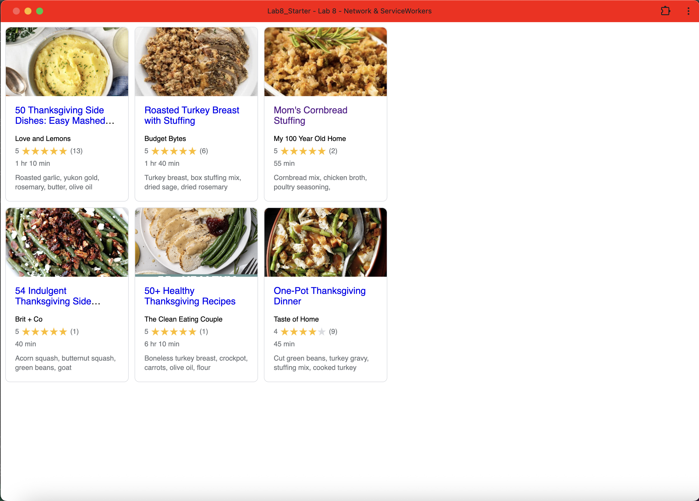

# Lab8-Starter

https://royhlee.github.io/Lab8_Starter/

Graceful degradation means making sure a web app still works even if some newer features aren’t available in the user’s browser. Service workers help with this by enhancing performance and offline capabilities without being required for the app to function. If a user’s browser doesn’t support service workers, the app can still load and operate using basic network requests. This fallback behavior is a form of graceful degradation because it ensures users still get a usable experience even without advanced features.

